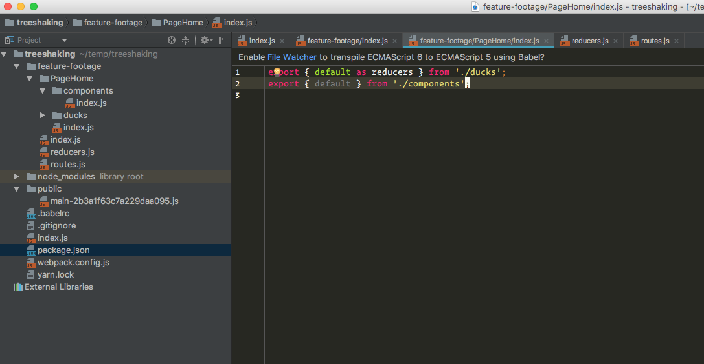

Webpack Treeshaking
===================

As can be seen from the screenshot above, WebStorm correctly detects that the `default` export from `feature-footage/PageHome/index.js` is not being used.

However, Webpack seems to be including it in the main bundle, thereby prevents code-splitting.

This seems to be due to us importing the `components/index.js` and re-exporting it. Even though we're only importing to re-export, Webpack doesn't seem to do 1 + 1.
